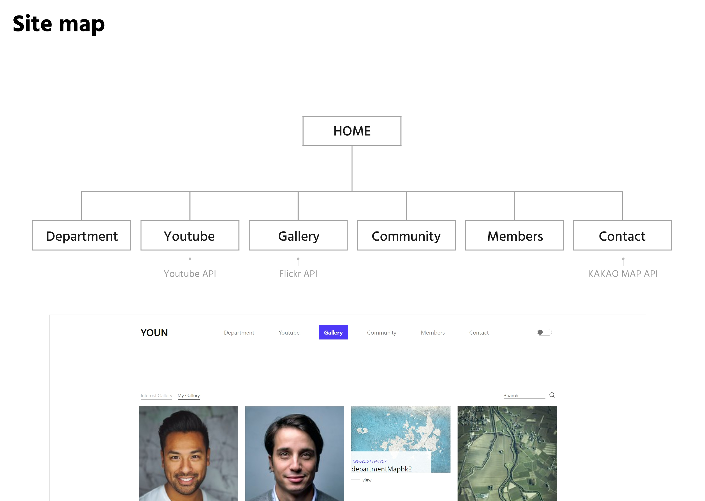
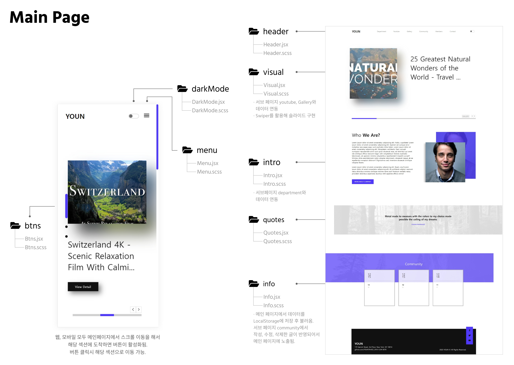
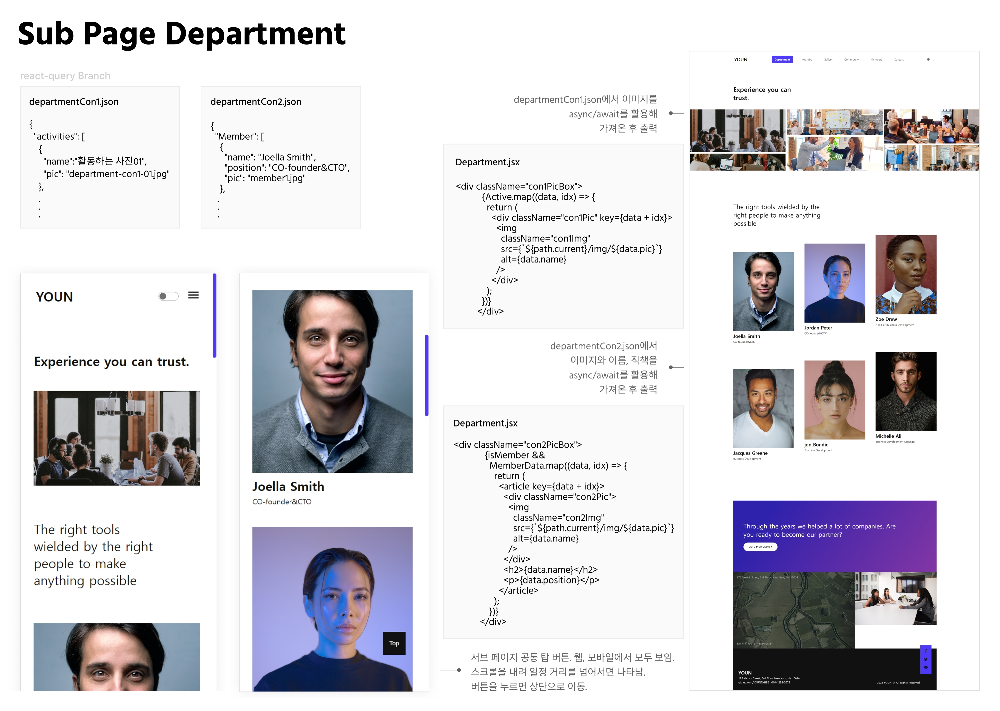
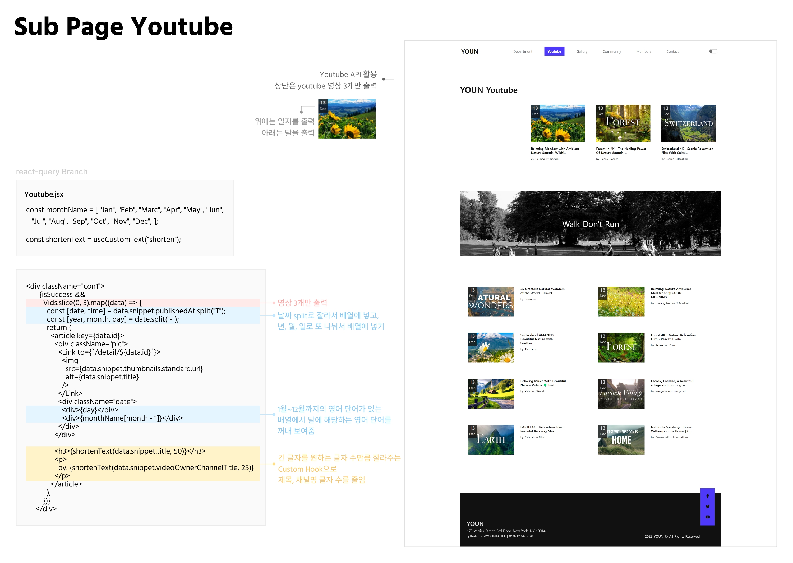
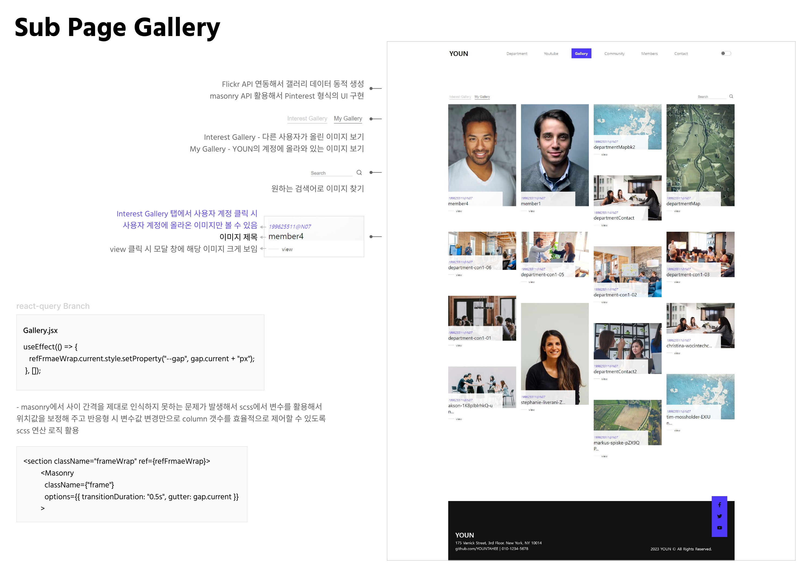
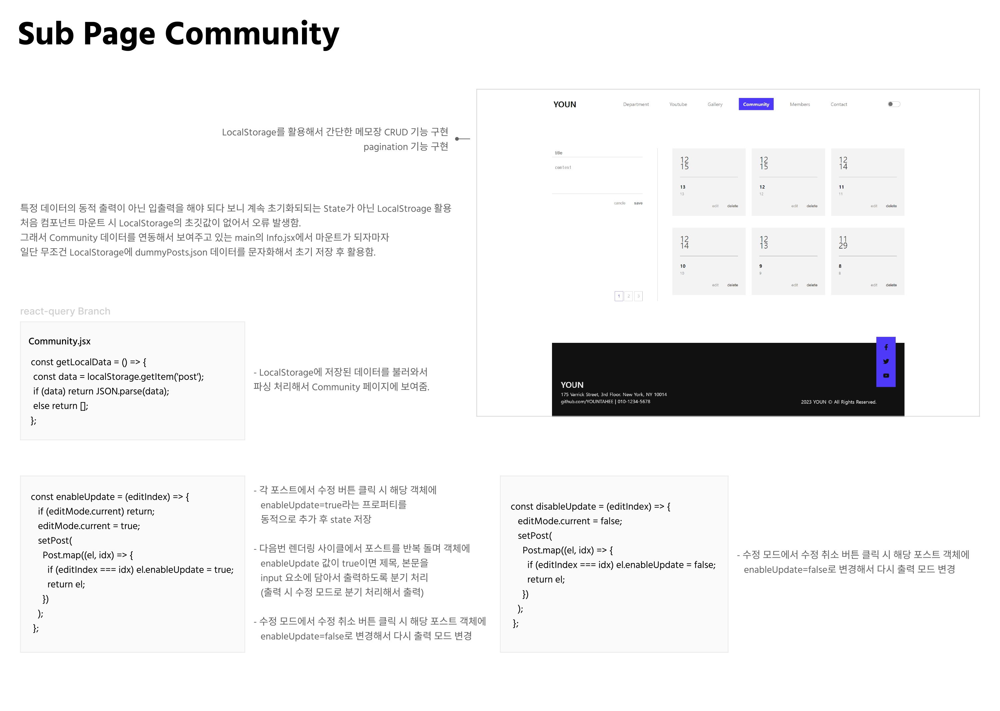
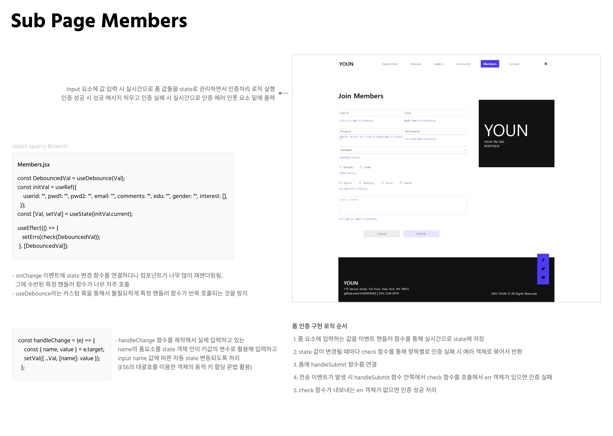
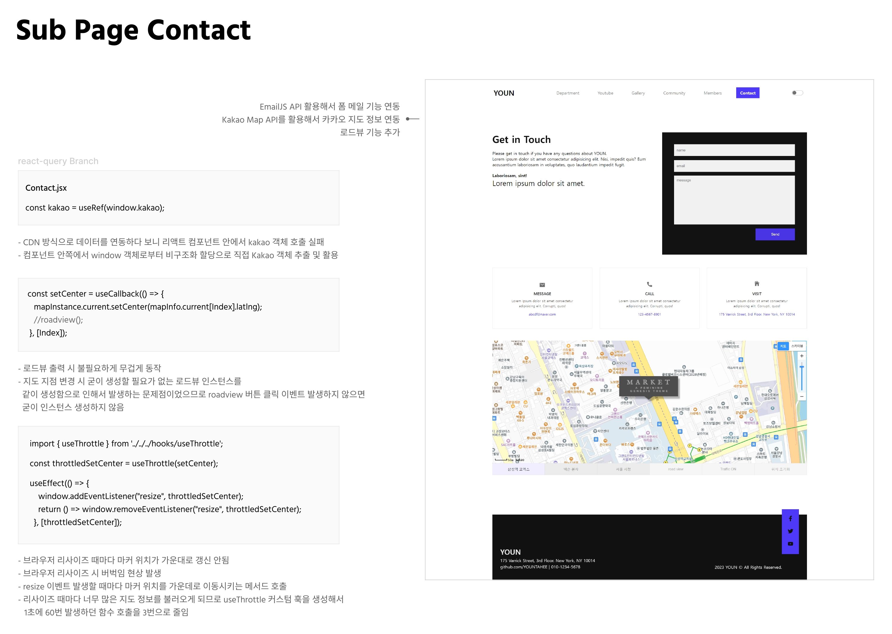
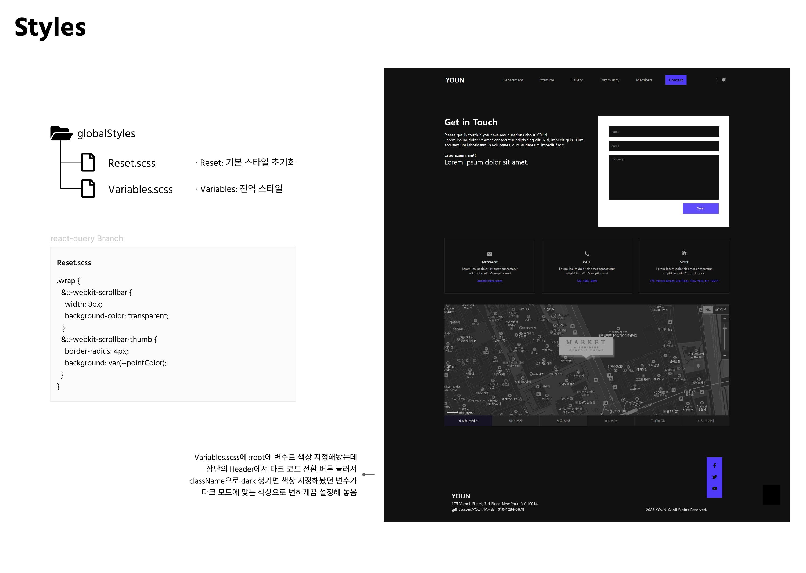

<h1>👋 Front-end 1인 프로젝트</h1>

○ 소개
 자연 관련 업무를 하는 외국 회사 YOUN 사이트

 

○ 기간
 2023.11.28 ~ 2024.01.30

 

○ Stacks 
  -공통 사용 Stacks  React 17버전, SCSS
   -master 브랜치  Redux 사용  
  -Redux-Saga 브랜치  Redux-Saga 사용  
  -Redux-Toolkit 브랜치  Redux-Toolkit 사용  
  -React-Query 브랜치  React-Query 사용

 
  

<h1>🔎 프로젝트 내용 보기</h1>

 

  <a href="https://www.dropbox.com/scl/fi/rpnrljjp7j63ypehk50u3/.pdf?rlkey=9p1xipja6yqqk8uczyfvomrdw&dl=0">○ 미니 프로젝트 설명서 PDF 링크</a>

 

  <a href="https://react-yth.vercel.app/">○ 프로젝트 URL 링크</a>

   

<h1>✨ 화면 구성 & 설명</h1>

 

  

  

  

  

  

  

  

  

